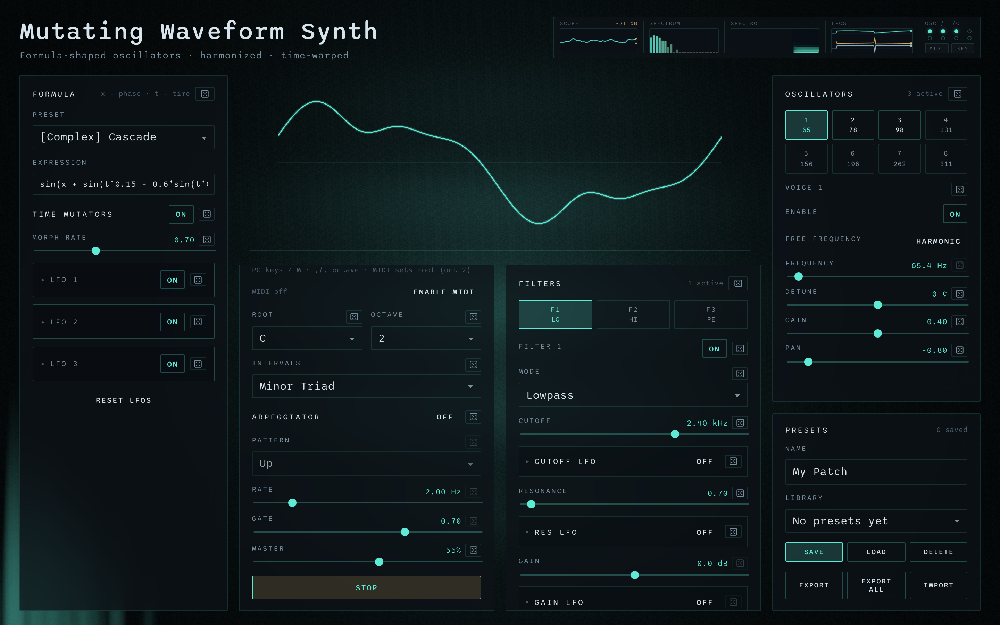

# Mutating Waveform Synth

Math-shaped wavetable synth: write an expression, morph it with nested LFOs, and voice it through harmonized oscillators, filters, FX, and MIDI.

**v1.1.3** · <a href="https://ciaccodavi.de/projects/mutating-waveform-synth" target="_blank" rel="noopener noreferrer">Live demo</a> · [Releases](https://github.com/CiaccoDavide/mutating-waveform-synth/releases) · [Repository](https://github.com/CiaccoDavide/mutating-waveform-synth) · [Changelog](CHANGELOG.md)



## Features

- **Formula wavetables** — expressions in `x` (phase) and `t` (time), with pedagogical presets from static waves to complex nested modulators, plus **Character** bases inspired by classic synth timbres
- **2-op FM** — optional global phase-modulation path (ratio + index) that replaces the wavetable while enabled
- **Wave edit mode** — draw with control points (exact Steps/Linear formulas, Smooth via Fourier), then Apply
- **Time mutators** — up to 3 LFOs + sub-LFOs that warp phase, fold, amp, and morph rate, then re-bake the shared table
- **8 oscillators** — equal-temperament harmony (incl. Osc + Sub / Osc + Sub −2) or free frequencies, detune, gain, pan; enable more voices to stack osc+sub pairs up the octaves
- **Filters** — three series biquads with per-parameter LFOs, plus a **ladder** (4-pole) stage after the bank
- **Effects** — chorus, multi-algorithm delay (digital / ping-pong / tape), and algorithmic reverb (room / hall / plate / freeverb)
- **Play modes** — continuous drone (optional arpeggiator) or polyphonic ADSR (arp can gate chord tones; audio unlocks on first note)
- **Input** — Web MIDI (channel + input port filter) and PC keyboard (Z–M, octave via `,` / `.`)
- **Presets** — save / load / import / export JSON patches (schema v4); read-only **Inspired by** factory patches plus auto-seeded editable copies under **Yours** — approximations, not emulations of trademarked instruments
- **Monitor strip** — scope, spectrum, spectrogram, LFO traces, voice activity, MIDI/KEY indicators
- **Desktop & Android** — packaged with [Tauri](https://tauri.app/) for macOS, Windows, Linux, and Android (APK)
- **Pattern Sequencer companion** — separate web/Tauri app that drives the synth over MIDI (IAC / loopMIDI) with linear, radar, bounce, rain, strings, tree, pulses, ratchet, cycles, phrase, arp, and brownian engines

### Signal path

```
8 wavetable voices → pan → 3× biquad → ladder → chorus → delay → reverb → master → analyser → out
```

### Inspired-by factory patches

| Patch | Character |
| --- | --- |
| Ladder Lead | Moog-ish fat saw + ladder + short delay |
| Acid Squelch | 303-ish edge + resonant ladder + tape delay |
| Chorus Pad | Juno-ish detuned poly + chorus + hall |
| Electric Keys | DX-ish 2-op FM + plate |
| Cinema Pad | CS-ish warm pad + soft chorus + hall |
| Poly Brass | OB-ish unison/fifth + chorus + room |

## Try it

| | |
| --- | --- |
| **Live demo** | <a href="https://ciaccodavi.de/projects/mutating-waveform-synth" target="_blank" rel="noopener noreferrer">ciaccodavi.de/projects/mutating-waveform-synth</a> |
| **Desktop / Android** | Download the latest build from [Releases](https://github.com/CiaccoDavide/mutating-waveform-synth/releases) (macOS Apple Silicon + Intel, Linux, Windows, Android APK) |
| **Web** | Build with `npm run build` and serve the `dist/` folder on your own host |

Click **Start** (drone) or play a note (ADSR) once to unlock the audio context on the web build.

## Develop

```bash
npm install
npm run dev
```

Desktop (requires [Rust](https://rustup.rs/)):

```bash
npm run tauri:dev
```

Production web build (static files in `dist/`, relative asset paths):

```bash
npm run build
npm run preview
```

Desktop bundles:

```bash
npm run tauri:build
```

Android APK (requires [Android SDK / NDK](https://v2.tauri.app/start/prerequisites/)):

```bash
npm run tauri:android:build
```

## Pattern Sequencer companion

**Mutating Pattern Sequencer** (`apps/sequencer/`) is a separate web + Tauri app that drives the synth over **Web MIDI** (Note On/Off). There is no in-app virtual port — both apps must share an OS MIDI loopback.

Use **Chrome or Edge** for Web MIDI (Safari support is limited). Set the synth to **ADSR**, match **MIDI channel** (1–16) on both sides, and pick the same loopback port (sequencer = MIDI out, synth = MIDI in).

### Pairing (macOS — IAC Driver)

Chromium **silently denies** MIDI access when zero devices exist (`Silently denying site request for MIDI access because no devices were detected`). Enable a loopback **before** clicking Enable MIDI:

1. Open **Audio MIDI Setup**.
2. **Window → Show MIDI Studio**.
3. Double-click **IAC Driver**.
4. Enable **Device is online** (add a bus/port if the list is empty).
5. **Quit and reopen the browser** (required after connecting a new MIDI device).
6. In the **sequencer** (`npm run seq:dev` → http://localhost:1430): **Enable MIDI** / **Retry MIDI**, select the IAC port as **MIDI out**, set **MIDI ch**.
7. In the **synth**: **Enable MIDI**, select the same IAC port as **MIDI in**, match **MIDI ch**, play mode **ADSR**.

### Pairing (Windows — loopMIDI)

1. Install and run [loopMIDI](https://www.tobias-erichsen.de/software/loopmidi.html); create a port.
2. Restart the browser if ports do not appear.
3. Select that port as MIDI out on the sequencer and MIDI in on the synth; match channels; synth in ADSR.

### Engines

| Mode | Behavior |
| --- | --- |
| **Linear** | Step grid; steps can be polyphonic (chords). |
| **Radar** | Concentric donut rings; Euclidean cells; sync phase / mute. |
| **Bouncing spheres** | Particles in a box; wall hits → notes (RAF physics + hit flashes). |
| **Rain** | Drops on pitch lanes; wind / gravity / splash / chord spread. |
| **Strings** | Random noise waves with a scan line or detector points. |
| **Tree** | Left-to-right branching walk; division / degree step / prune. |
| **Pulses** | Euclid track + accent / rotate-on-loop / gate skew. |
| **Ratchet** | Euclid pulses with micro-repeats and velocity ramp. |
| **Cycles** | Cycle morph: each loop advances a snapshot (steps/pulses/pitch base). |
| **Phrase** | Euclid rhythm + pitch-range LFO (saw / tri / sine / random). |
| **Arp** | Chord arpeggio (up / down / up-down / random) with rate and octaves. |
| **Brownian** | Random walk on scale degrees with inertia and hold. |
| **Orbit** | Bodies orbit; spoke crossings and alignments → notes. |
| **Cellular** | Wolfram-like 1D CA; active cells → scale degrees. |
| **Markov** | Pitch chain biased toward nearby scale steps. |
| **Polyrhythm** | 2–4 independent Euclid lanes; polyphonic when they coincide. |
| **Swarm** | Soft boids; notes when neighbors approach. |
| **Pendulum** | Coupled pendulums; bottom crossings and sync chords. |
| **Lissajous** | a:b curve trailer; axis crossings and lattice cells. |
| **Ripple** | Euclid hits emit expanding rings that trigger fixed nodes. |

Shared: BPM / swing / **humanize** transport, **trail / bloom / vignette** viz FX, twin slider+number params, scale + root, gate / velocity, WebGL2 soft particles + FBO post, factory presets, localStorage save, JSON import/export.

### Develop / build sequencer

```bash
npm install --prefix apps/sequencer
npm run seq:dev          # http://localhost:1430
npm run seq:build
npm run seq:preview
npm run seq:tauri:dev    # desktop shell (requires Rust)
npm run seq:tauri:build
```

Or from `apps/sequencer/`: `npm install` then `npm run dev` / `tauri:dev` / `build`.

## Stack

- React 19 + Vite + TypeScript
- Web Audio API + AudioWorklets (wavetable, ladder, reverb) and native DelayNode FX
- WebGL2 background visualizer
- Tiny formula compiler (`sin`, `cos`, `tanh`, `step`, `lerp`, …)
- Tauri 2 for native shells

## License

[MIT](LICENSE) © CiaccoDavide
